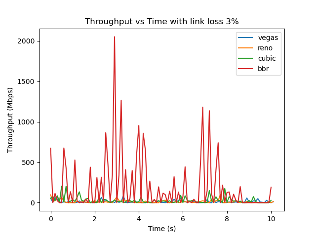

# Question 1

**(a)** The network topology called `NetworkTopo()` has been defined inside the q1.py file using the python api of mininet. `pingall` command inside mininet give the following output.  
   
**(b)** Running the wireshark on router `ra` using the command `ra wireshark &`, and then running the `pingall` command inside mininet captures the following packets. The entire TCP Dump has been captured and saved inside the file called `q1_packets.pcapng`.
  
**(c)** Updated the routing table in both ra and rc so that the packets are only sent to the rb, where they are again forwarded.

> Comparing latency using the ping command gave the following
>
> 1. For path h1 -> ra -> rc -> h6
>    
> 2. For the path h1 -> ra -> rb -> rc -> h6
>    

**(d)** The routing tables are printed using the code. The routing tables are in order ra, rb, rc.

> For (a),
>   
> For (c),  
>   
> The routing tables have also been saved to the files `q1_routes_a.txt` and `q1_routes_c.txt` for the respective questions (a) and (c)

# Question 2

**(a)** The network topology given in the image is defined in `NetworkTopo()` class, and the class takes the link*loss parameter, which sets the value of the \_s1-s2* link packet loss percentage. The file `q2.py` can be run using python with `sudo` permissions. The file can be run using the below command. Where the values of config(required) can be `b` (or) `c`, values of congestion control(not required) can be any one of `{Vegas, Cubic, Reno, BBR}`, and values of link loss(not required) can be any integer between `0` and `100`

```console
$ python q2.py --config[-c] <config> --link-loss[-ll] <link loss> --congestion-control[-cc] <congestion control>
```

> **_Note:_**
>
> 1. If no `congestion-control` option is given for config `b` then the program plots Throughput for all values of all the above given congestion control mechanism, for the client `h1`.
> 2. If a `congestion-control` option is given for config `c` then the program plots Throughput for all hosts `h1`, `h2`, and `h3`, for the given value of congestion control in the same graph. If it is not given then it plots Throughput for all values of the congestion control mechanism for each given host {`h1`, `h2`, `h3`} in a different graph.
> 3. If no `link-loss` option is mentioned then the throughput analysis is done using `0` link loss for `s1-s2` link.
> 4. The program does not enter `mininet` CLI.

**(b)** The client is run for `10sec` and the plots are obtained by running the file using the below command. It can be observed that BBR congestion control gives less throughput.

```console
sudo python q2.py --config b
```


**(c)** The following commands were used to get the throughput plots for different hosts using the mentioned congestion control algorithm.

> **_Note:_** These graphs when run at different times might produce different plots depending on which host first starts sending packets.

```console
sudo python q2.py --config c -cc BBR
```


```console
sudo python q2.py --config c -cc Cubic
```


```console
sudo python q2.py --config c -cc Reno
```


```console
sudo python q2.py --config c -cc Vegas
```


The following command was used to get the throughput plots for different congestion control algorithm for a given host.

```console
sudo python q2.py --config c
```


**(d)** The following command was used to get the throughput plots on client side for different congestion control algorithm for a given link loss{`1`, `3`}.

```console
sudo python q2.py --config b -ll 1
```


```console
sudo python q2.py --config b -ll 3
```


